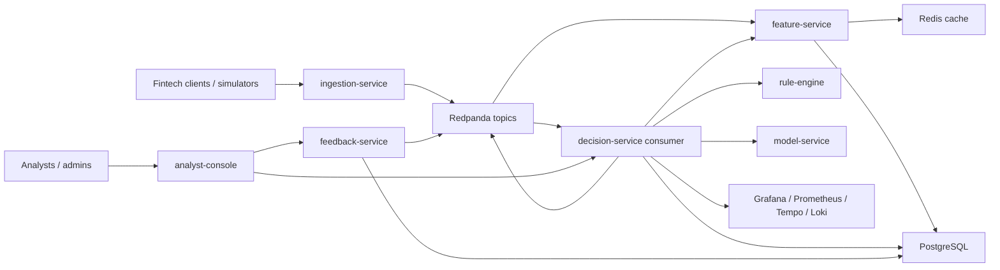

# SentinelStream

SentinelStream is a production-style monorepo for a real-time fraud and account takeover defense platform built to showcase backend, ML platform, SRE, and security engineering depth in one portfolio system.

It ingests authentication and transaction events, computes low-latency behavioral features, applies configurable fraud rules, calls an ML scoring service with active and shadow models, produces real-time decisions, stores analyst feedback, and exposes a secure internal console with full-stack observability and a credible AWS deployment path.

## Resume Highlights

- Built a real-time fraud and account takeover detection platform with a sub-75 ms p95 decision latency target and graceful degraded mode.
- Designed event-driven feature computation and hybrid rule + ML decisioning with shadow model evaluation and drift monitoring.
- Instrumented distributed Python services with OpenTelemetry traces, Prometheus metrics, Loki-ready structured logs, dashboards, alerting, and runbooks.
- Deployed containerized services to Kubernetes with Terraform-managed AWS infrastructure, EKS, ECR publishing, Helm releases, and GitHub Actions promotion flows.

## Architecture



## Core Services

| Service | Purpose | Port |
| --- | --- | --- |
| `ingestion-service` | Strict event validation, idempotent ingestion, raw topic publishing | `8001` |
| `feature-service` | Streaming feature aggregation, Redis-backed lookup API, Postgres persistence | `8002` |
| `rule-engine` | YAML-configured deterministic fraud and security rules with explanations | `8003` |
| `model-service` | Active and candidate model inference, shadow comparison, drift metrics | `8004` |
| `decision-service` | Rule + feature + model orchestration, resilience logic, decision events | `8005` |
| `feedback-service` | Analyst labels, audit trail, retraining feedback topic | `8006` |
| `analyst-console` | Secure internal triage UI for decisions, rule hits, features, and labels | `8007` |

## Local Quickstart

Prerequisites:

- Python `3.12`
- Docker and Docker Compose
- GNU Make or compatible `make`

```bash
Copy-Item .env.example .env
make up
make train-models
make demo
```

Linux and macOS users can replace `Copy-Item` with `cp`.

Repository validation without Docker, Helm, or Terraform CLIs installed:

```bash
python -m venv .venv
.venv\Scripts\python -m pip install --upgrade pip setuptools wheel
.venv\Scripts\python -m pip install .[dev]
make PYTHON=.venv\Scripts\python test
make PYTHON=.venv\Scripts\python validate-delivery
```

The service runtime target remains Python `3.12`, and the repo verification harness is also pinned to pass in newer local Python environments where prebuilt wheels are available.

Open:

- Grafana: [http://localhost:3000](http://localhost:3000)
- Redpanda Console: [http://localhost:8080](http://localhost:8080)
- Analyst Console: [http://localhost:8007](http://localhost:8007)

Default local analyst password: `demo-password`

Default Grafana credentials: `admin` / `admin`

## Recruiter Demo Sequence

1. Start the platform with `make up`.
2. Train and bootstrap the active and shadow models with `make train-models`.
3. Run the integrated suspicious demo path with `make demo`.
4. Open the analyst console and inspect the decision generated for `acct-1001`.
5. Show the rule hits, feature snapshot, active vs candidate model outputs, model registry, and latest evaluation report.
6. Submit analyst feedback and show the linked audit trail.
7. Open Grafana and walk through the system overview, decision latency, stream health, and drift dashboards.
8. Trigger `make chaos-model-timeout` and re-run a score request to demonstrate degraded mode and alert visibility.

## Example API Calls

```bash
curl -X POST http://localhost:8001/v1/events \
  -H "Content-Type: application/json" \
  -H "Idempotency-Key: demo-login-001" \
  -d @data/samples/login_attempt.json
```

```bash
curl -X POST http://localhost:8005/v1/decisions/score \
  -H "Content-Type: application/json" \
  -d @data/samples/decision_request.json
```

## Reliability and Security Highlights

- Strict Pydantic validation with extra fields rejected.
- Idempotent ingestion keyed by explicit `Idempotency-Key`.
- Retry, timeout, and circuit-breaker protected downstream calls inside `decision-service`.
- Heuristic fallback mode when feature or model dependencies are unhealthy.
- OpenTelemetry traces across FastAPI, HTTPX, and Kafka producer and consumer hops.
- Structured JSON logs with request IDs and trace IDs, scraped by Promtail into Loki and linked back to Tempo traces in Grafana.
- Prometheus metrics for HTTP, decisioning, dependency latency, cache operations, broker health, DLQ growth, and model drift.
- JWT-based analyst and admin access with RBAC and audit logging.
- PII-aware structured logging that masks IP addresses and sensitive metadata.
- Dead-letter topic for poison events and replay-safe event handling.

## AWS Deployment Path

Terraform provisions:

- VPC, subnets, route tables, NAT, and EKS subnet tagging
- EKS with IRSA enabled and managed node groups
- ECR repositories with lifecycle policies and image scanning
- an encrypted S3 artifact bucket

Helm deploys the application tier to EKS.

The chart expects PostgreSQL, Redis, and Kafka-compatible endpoints to be supplied per environment. That tradeoff is deliberate:

- local Docker Compose remains fully self-contained
- the AWS path stays realistic for platform engineering discussion
- data dependencies can be either managed services or separately deployed cluster workloads

If you want to publish this project from your own GitHub account and deploy it live, follow [docs/github-setup.md](C:/Users/OMEN/Desktop/kayode/SentinelStream/docs/github-setup.md).

Exact bootstrap:

```bash
cd infra/terraform/environments/dev
cp terraform.tfvars.example terraform.tfvars
cp backend.hcl.example backend.hcl
terraform init -backend-config=backend.hcl
terraform apply
aws eks update-kubeconfig --name sentinelstream-dev --region eu-west-1
helm upgrade --install sentinelstream infra/helm/sentinelstream \
  --namespace sentinelstream \
  --create-namespace \
  --values infra/helm/sentinelstream/values-dev.yaml \
  --set-string global.imageRegistry=<account>.dkr.ecr.eu-west-1.amazonaws.com/sentinelstream \
  --set-string global.imageTag=<git-sha> \
  --set-string config.postgres.host=<postgres-host> \
  --set-string config.kafkaBootstrapServers=<broker-host>:9092 \
  --atomic \
  --wait
```

## CI/CD

GitHub Actions workflows:

- `ci.yml`
  - lint, tests, `compileall`, Terraform validation, Helm lint and render validation, `pip-audit`, and Trivy filesystem scanning
- `deploy.yml`
  - runs on merge to `main`, bootstraps model artifacts, builds and scans images, pushes to ECR, deploys `dev`, smoke-tests the release, and uploads a benchmark report artifact
- `promote-prod.yml`
  - manually promotes a previously built image tag into `prod`

Recommended GitHub Environment variables:

- `AWS_REGION`
- `ECR_REGISTRY`
- `EKS_CLUSTER_NAME`
- `KUBE_NAMESPACE`
- `POSTGRES_HOST`
- `POSTGRES_PORT`
- `POSTGRES_DB`
- `POSTGRES_USER`
- `KAFKA_BOOTSTRAP_SERVERS`

Recommended GitHub Environment secrets:

- `AWS_DEPLOY_ROLE_ARN`
- `JWT_SECRET`
- `ANALYST_CONSOLE_PASSWORD`
- `POSTGRES_PASSWORD`
- `REDIS_URL`

## Benchmark Report

Local benchmarks:

```bash
make benchmark
make benchmark-model
```

Outputs:

- `tests/load/results/latest_benchmark.json`
- `tests/load/results/latest_model_benchmark.json`

Cloud benchmark path:

- the `deploy.yml` workflow runs a post-deploy decision benchmark against the dev release
- the resulting `latest_benchmark.json` is uploaded as a GitHub Actions artifact named `decision-benchmark-<git-sha>`

Primary targets:

- p50 `< 35 ms`
- p95 `< 75 ms`
- p99 `< 150 ms`

Release verification path:

- `make test`
- `make validate-delivery`
- `make helm-lint`
- `make terraform-dev-plan`

## Rollback Summary

- Helm upgrades use `--atomic` for auto-rollback on failed releases.
- Manual rollback is `helm rollback sentinelstream <revision> -n sentinelstream --wait`.
- Prod promotion reuses an existing image tag, so rollbacks stay revision-based and image-tag based instead of rebuild-based.

## Docs

- `docs/architecture.md`
- `docs/system-design.md`
- `docs/threat-model.md`
- `docs/runbook.md`
- `docs/benchmarking.md`
- `docs/api-spec.md`
- `docs/deployment.md`
- `docs/github-setup.md`
- `docs/adr/`

## Exact Commands

```bash
Copy-Item .env.example .env
make up
make train-models
make demo
make benchmark
make benchmark-model
make validate-delivery
make helm-lint
make helm-template-dev
make terraform-dev-plan
make chaos-model-timeout
make chaos-cache-disable
make chaos-broker-down
```

Useful endpoints:

- `GET /health/live` and `GET /health/ready` on every service
- `GET /metrics` on every service
- `GET /v1/decisions?account_id=acct-1001&limit=5` with analyst JWT
- `GET /v1/features/accounts/acct-1001` with analyst JWT
- `GET /v1/model/evaluation/latest` with analyst JWT
- `GET /v1/model/registry` with analyst JWT
- `GET /v1/model/shadow/summary` with analyst JWT
