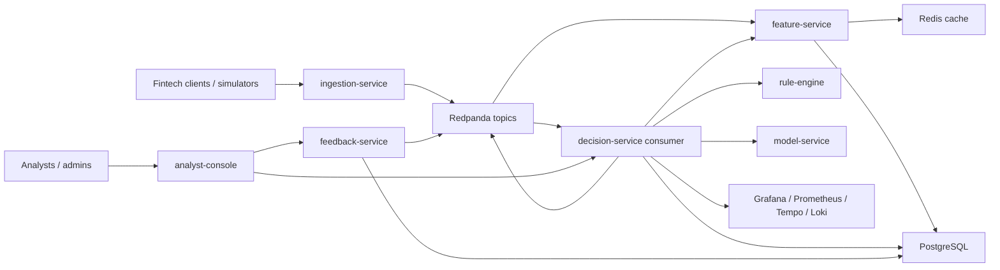

# SentinelStream

SentinelStream is a production-style monorepo for a real-time fraud and account takeover defense platform built to showcase backend, ML platform, SRE, and security engineering depth in one portfolio system.

It ingests authentication and transaction events, computes low-latency behavioral features, applies configurable fraud rules, calls an ML scoring service with active and shadow models, produces real-time decisions, stores analyst feedback, and exposes a secure internal console with full-stack observability and a credible AWS deployment path.

## Resume Highlights

- Built a real-time fraud and account takeover detection platform with a sub-75 ms p95 decision latency target and graceful degraded mode.
- Designed event-driven feature computation and hybrid rule + ML decisioning with shadow model evaluation and drift monitoring.
- Instrumented distributed Python services with OpenTelemetry traces, Prometheus metrics, Loki-ready structured logs, dashboards, alerting, and runbooks.
- Deployed containerized services to Kubernetes with Terraform-managed AWS infrastructure, EKS, ECR publishing, Helm releases, and GitHub Actions promotion flows.

## Architecture



## Core Services

| Service | Purpose | Port |
| --- | --- | --- |
| `ingestion-service` | Strict event validation, idempotent ingestion, raw topic publishing | `8001` |
| `feature-service` | Streaming feature aggregation, Redis-backed lookup API, Postgres persistence | `8002` |
| `rule-engine` | YAML-configured deterministic fraud and security rules with explanations | `8003` |
| `model-service` | Active and candidate model inference, shadow comparison, drift metrics | `8004` |
| `decision-service` | Rule + feature + model orchestration, resilience logic, decision events | `8005` |
| `feedback-service` | Analyst labels, audit trail, retraining feedback topic | `8006` |
| `analyst-console` | Secure internal triage UI for decisions, rule hits, features, and labels | `8007` |

## Docker Compose Quickstart

Prerequisites:

- Python `3.12`
- Docker and Docker Compose
- GNU Make or compatible `make`

```bash
Copy-Item .env.example .env
make up
make train-models
make demo
```

Linux and macOS users can replace `Copy-Item` with `cp`.

Repository validation without Docker, Helm, or Terraform CLIs installed:

```bash
python -m venv .venv
.venv\Scripts\python -m pip install --upgrade pip setuptools wheel
.venv\Scripts\python -m pip install .[dev]
make PYTHON=.venv\Scripts\python test
make PYTHON=.venv\Scripts\python validate-delivery
```

The service runtime target remains Python `3.12`, and the repo verification harness is also pinned to pass in newer local Python environments where prebuilt wheels are available.

Open:

- Grafana: [http://localhost:3000](http://localhost:3000)
- Redpanda Console: [http://localhost:8080](http://localhost:8080)
- Analyst Console: [http://localhost:8007](http://localhost:8007)

Default local analyst password: `demo-password`

Default Grafana credentials: `admin` / `admin`

## Desktop App

The repo now includes an initial desktop wrapper at
[apps/analyst-desktop/README.md](C:/Users/OMEN/Desktop/kayode/SentinelStream/apps/analyst-desktop/README.md).
It turns the existing `analyst-console` into a native Windows desktop shell so
we can evolve SentinelStream toward a Microsoft Store-ready analyst workstation.

What the desktop shell supports today:

- a native Electron window for the analyst console
- `external` mode for a running SentinelStream backend
- `embedded` development mode that launches the FastAPI analyst console process
- persistent desktop settings with an in-app settings screen
- a branded loading screen plus an offline recovery screen
- Windows packaging scripts for installer and portable builds

Fastest way to try it with the current stack:

```powershell
docker compose up -d postgres redis redpanda otel-collector rule-engine model-service feature-service decision-service feedback-service analyst-console
cd apps/analyst-desktop
npm install
npm run dev
```

For a pure development shell that starts the analyst console process itself:

```powershell
python -m pip install .[dev]
$env:SENTINEL_DESKTOP_BACKEND_MODE = "embedded"
$env:SENTINEL_DESKTOP_PYTHON = "$PWD\\.venv314\\Scripts\\python.exe"
cd apps/analyst-desktop
npm run dev
```

Packaging commands:

```powershell
cd apps/analyst-desktop
npm install
npm run pack
npm run dist
```

This is the first desktop productization step. The next phase for Store release
would be production icon assets, privacy-policy/support metadata, and a final
Windows Store packaging workflow.

Store-release planning docs:

- [docs/desktop-store-release.md](C:\Users\OMEN\Desktop\kayode\SentinelStream\docs\desktop-store-release.md)
- [docs/legal/privacy-policy.md](C:\Users\OMEN\Desktop\kayode\SentinelStream\docs\legal\privacy-policy.md)
- [docs/legal/support.md](C:\Users\OMEN\Desktop\kayode\SentinelStream\docs\legal\support.md)

## Local Kubernetes Demo

When AWS is unavailable, the fastest screenshot-friendly fallback is the local
Kubernetes path. It reuses the existing Helm chart plus the
`infra/kubernetes/demo-data` manifests and exposes the analyst console through
`kubectl port-forward`.

Prerequisites:

- Docker Desktop Kubernetes or [kind](https://kind.sigs.k8s.io/)
- `kubectl`
- `helm`
- Docker
- Python `3.12`

Create a local cluster with kind:

```bash
kind create cluster --name sentinelstream-local
```

Build the local images and preload demo model artifacts:

```bash
python -m pip install .[dev]
make k8s-local-build-images
make k8s-kind-load-images
```

Deploy the demo dependency stack:

```bash
make k8s-local-demo-data
```

Deploy the application with the new local Helm values:

```bash
make helm-template-local
make k8s-local-deploy
make k8s-local-status
```

Seed demo traffic once the pods are healthy:

```bash
make k8s-local-demo
```

Expose the analyst console and open it in a browser:

```bash
make k8s-local-port-forward
```

Open [http://127.0.0.1:8007](http://127.0.0.1:8007).

Default local demo credentials:

- Analyst console username: `demo-analyst`
- Analyst console role: `analyst`
- Analyst console password: `demo-password`
- Namespace: `sentinelstream`
- Release: `sentinelstream`

Keep the port-forward terminal open while you browse the console.

If you are using Docker Desktop Kubernetes instead of kind, skip
`make k8s-kind-load-images`. The rest of the flow stays the same.

If GNU `make` is not installed, you can run the same flow directly from
PowerShell:

```powershell
kubectl create namespace sentinelstream-data --dry-run=client -o yaml | kubectl apply -f -
kubectl -n sentinelstream-data create secret generic sentinelstream-demo-data --from-literal=POSTGRES_PASSWORD='sentinel' --dry-run=client -o yaml | kubectl apply -f -
kubectl -n sentinelstream-data apply -f infra/kubernetes/demo-data/postgres.yaml
kubectl -n sentinelstream-data apply -f infra/kubernetes/demo-data/redis.yaml
kubectl -n sentinelstream-data apply -f infra/kubernetes/demo-data/redpanda.yaml
kubectl -n sentinelstream-data rollout status deployment/sentinelstream-dev-postgres --timeout=10m
kubectl -n sentinelstream-data rollout status deployment/sentinelstream-redis --timeout=5m
kubectl -n sentinelstream-data rollout status deployment/sentinelstream-dev-redpanda --timeout=10m

helm upgrade --install sentinelstream infra/helm/sentinelstream `
  --namespace sentinelstream `
  --create-namespace `
  --values infra/helm/sentinelstream/values-local.yaml `
  --set-string global.imageRegistry=sentinelstream `
  --set-string global.imageTag=local `
  --set-string secrets.stringData.JWT_SECRET=local-demo-jwt-secret-2026-please-change `
  --set-string secrets.stringData.ANALYST_CONSOLE_PASSWORD=demo-password `
  --set-string secrets.stringData.POSTGRES_PASSWORD=sentinel `
  --debug `
  --wait `
  --timeout 15m

kubectl -n sentinelstream exec deployment/sentinelstream-ingestion-service -- python /app/scripts/demo_scenarios.py
kubectl -n sentinelstream port-forward svc/sentinelstream-analyst-console 8007:8007
```

Helpful checks while bringing the demo up:

```bash
kubectl get pods -n sentinelstream-data
kubectl get pods -n sentinelstream
kubectl logs deployment/sentinelstream-dev-redpanda -n sentinelstream-data --tail=120
kubectl logs deployment/sentinelstream-analyst-console -n sentinelstream --tail=120
```

Known local-demo limitations:

- PostgreSQL, Redis, and Redpanda are single-node and ephemeral on purpose.
- Autoscaling is disabled in local mode.
- The analyst console is exposed with port-forward instead of a LoadBalancer.
- AWS, EKS, and ECR deployment remain supported, but they are not required for the local demo flow.

## Recruiter Demo Sequence

1. Start the platform with `make up`.
2. Train and bootstrap the active and shadow models with `make train-models`.
3. Run the integrated suspicious demo path with `make demo`.
4. Open the analyst console and inspect the decision generated for `acct-1001`.
5. Show the rule hits, feature snapshot, active vs candidate model outputs, model registry, and latest evaluation report.
6. Submit analyst feedback and show the linked audit trail.
7. Open Grafana and walk through the system overview, decision latency, stream health, and drift dashboards.
8. Trigger `make chaos-model-timeout` and re-run a score request to demonstrate degraded mode and alert visibility.

## Example API Calls

```bash
curl -X POST http://localhost:8001/v1/events \
  -H "Content-Type: application/json" \
  -H "Idempotency-Key: demo-login-001" \
  -d @data/samples/login_attempt.json
```

```bash
curl -X POST http://localhost:8005/v1/decisions/score \
  -H "Content-Type: application/json" \
  -d @data/samples/decision_request.json
```

## Reliability and Security Highlights

- Strict Pydantic validation with extra fields rejected.
- Idempotent ingestion keyed by explicit `Idempotency-Key`.
- Retry, timeout, and circuit-breaker protected downstream calls inside `decision-service`.
- Heuristic fallback mode when feature or model dependencies are unhealthy.
- OpenTelemetry traces across FastAPI, HTTPX, and Kafka producer and consumer hops.
- Structured JSON logs with request IDs and trace IDs, scraped by Promtail into Loki and linked back to Tempo traces in Grafana.
- Prometheus metrics for HTTP, decisioning, dependency latency, cache operations, broker health, DLQ growth, and model drift.
- JWT-based analyst and admin access with RBAC and audit logging.
- PII-aware structured logging that masks IP addresses and sensitive metadata.
- Dead-letter topic for poison events and replay-safe event handling.

## AWS Deployment Path

Terraform provisions:

- VPC, subnets, route tables, NAT, and EKS subnet tagging
- EKS with IRSA enabled and managed node groups
- ECR repositories with lifecycle policies and image scanning
- an encrypted S3 artifact bucket

Helm deploys the application tier to EKS.

The chart expects PostgreSQL, Redis, and Kafka-compatible endpoints to be supplied per environment. That tradeoff is deliberate:

- local Docker Compose remains fully self-contained
- the AWS path stays realistic for platform engineering discussion
- data dependencies can be either managed services or separately deployed cluster workloads

If you want to publish this project from your own GitHub account and deploy it live, follow [docs/github-setup.md](C:/Users/OMEN/Desktop/kayode/SentinelStream/docs/github-setup.md).

Exact bootstrap:

```bash
cd infra/terraform/environments/dev
cp terraform.tfvars.example terraform.tfvars
cp backend.hcl.example backend.hcl
terraform init -backend-config=backend.hcl
terraform apply
aws eks update-kubeconfig --name sentinelstream-dev --region eu-west-1
helm upgrade --install sentinelstream infra/helm/sentinelstream \
  --namespace sentinelstream \
  --create-namespace \
  --values infra/helm/sentinelstream/values-dev.yaml \
  --set-string global.imageRegistry=<account>.dkr.ecr.eu-west-1.amazonaws.com/sentinelstream \
  --set-string global.imageTag=<git-sha> \
  --set-string config.postgres.host=<postgres-host> \
  --set-string config.kafkaBootstrapServers=<broker-host>:9092 \
  --atomic \
  --wait
```

## CI/CD

GitHub Actions workflows:

- `ci.yml`
  - lint, tests, `compileall`, Terraform validation, Helm lint and render validation, `pip-audit`, and Trivy filesystem scanning
- `deploy.yml`
  - runs on merge to `main`, bootstraps model artifacts, builds and scans images, pushes to ECR, deploys `dev`, smoke-tests the release, and uploads a benchmark report artifact
- `promote-prod.yml`
  - manually promotes a previously built image tag into `prod`

Recommended GitHub Environment variables:

- `AWS_REGION`
- `ECR_REGISTRY`
- `EKS_CLUSTER_NAME`
- `KUBE_NAMESPACE`
- `POSTGRES_HOST`
- `POSTGRES_PORT`
- `POSTGRES_DB`
- `POSTGRES_USER`
- `KAFKA_BOOTSTRAP_SERVERS`

Recommended GitHub Environment secrets:

- `AWS_DEPLOY_ROLE_ARN`
- `JWT_SECRET`
- `ANALYST_CONSOLE_PASSWORD`
- `POSTGRES_PASSWORD`
- `REDIS_URL`

## Benchmark Report

Local benchmarks:

```bash
make benchmark
make benchmark-model
```

Outputs:

- `tests/load/results/latest_benchmark.json`
- `tests/load/results/latest_model_benchmark.json`

Cloud benchmark path:

- the `deploy.yml` workflow runs a post-deploy decision benchmark against the dev release
- the resulting `latest_benchmark.json` is uploaded as a GitHub Actions artifact named `decision-benchmark-<git-sha>`

Primary targets:

- p50 `< 35 ms`
- p95 `< 75 ms`
- p99 `< 150 ms`

Release verification path:

- `make test`
- `make validate-delivery`
- `make helm-lint`
- `make terraform-dev-plan`

## Rollback Summary

- Helm upgrades use `--atomic` for auto-rollback on failed releases.
- Manual rollback is `helm rollback sentinelstream <revision> -n sentinelstream --wait`.
- Prod promotion reuses an existing image tag, so rollbacks stay revision-based and image-tag based instead of rebuild-based.

## Docs

- `docs/architecture.md`
- `docs/system-design.md`
- `docs/threat-model.md`
- `docs/runbook.md`
- `docs/benchmarking.md`
- `docs/api-spec.md`
- `docs/deployment.md`
- `docs/github-setup.md`
- `docs/desktop-store-release.md`
- `docs/legal/privacy-policy.md`
- `docs/legal/support.md`
- `docs/adr/`

## Exact Commands

```bash
Copy-Item .env.example .env
make up
make train-models
make demo
make benchmark
make benchmark-model
make validate-delivery
make helm-lint
make helm-template-dev
make helm-template-local
make k8s-local-up
make k8s-local-demo
make k8s-local-port-forward
make terraform-dev-plan
make chaos-model-timeout
make chaos-cache-disable
make chaos-broker-down
```

Useful endpoints:

- `GET /health/live` and `GET /health/ready` on every service
- `GET /metrics` on every service
- `GET /v1/decisions?account_id=acct-1001&limit=5` with analyst JWT
- `GET /v1/features/accounts/acct-1001` with analyst JWT
- `GET /v1/model/evaluation/latest` with analyst JWT
- `GET /v1/model/registry` with analyst JWT
- `GET /v1/model/shadow/summary` with analyst JWT
